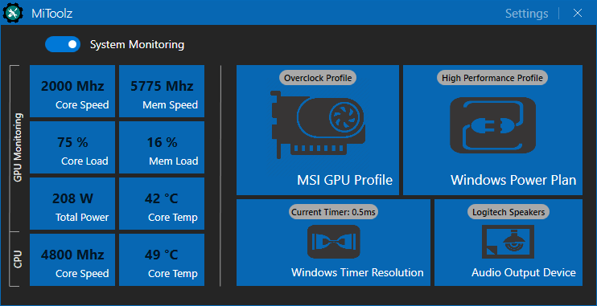

# MiToolz

#### About >
Personal Nvidia GPU &amp; Creative SoundBlaster Audio QuickTool with built-in real-time monitoring

#### Framework & library dependencies >
MahApps.Metro > https://github.com/MahApps/MahApps.Metro  
LibreHardwareMonitorLib > https://github.com/LibreHardwareMonitor/LibreHardwareMonitor

#### Notes >
1. The 'Switch Device' option requires the brilliant free & open source 'SoundSwitch' (https://github.com/Belphemur/SoundSwitch) application to be installed and running
2. Changing GPU Profiles will need the 'MSI-Afterburner' application to be installed (https://www.guru3d.com/files-details/msi-afterburner-beta-download.html) (doesn't need to be running. MiToolz will send the selected profile to MSI-Afterburner and then close it immediately)

#### Planned > 
1. Implement universal audio equalizer to remove reliance of proprietary audio software ie, Creative SoundBlaster control panel etc
2. Add ability to switch audio output devices from within MiToolz itself
3. Add option (service) for changing the Windows Timer Resolution setting, ie 1ms or 0.5ms etc

#### Screens > 

Main UI ..  
 

Settings Panel ..  
 

