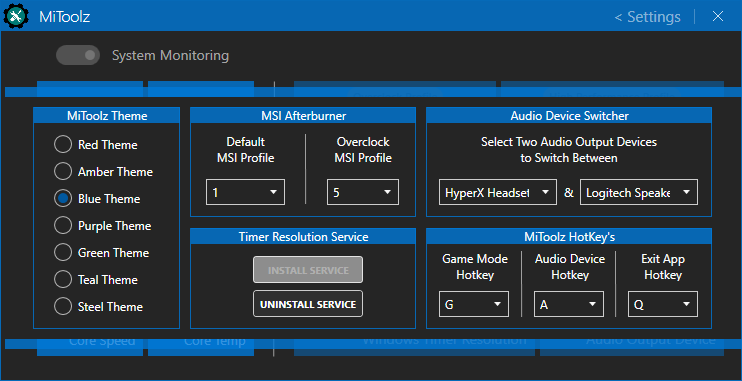

## 

## About >
Personal Nvidia GPU &amp; Audio QuickTool with built-in real-time monitoring

## Framework & library dependencies >
MahApps.Metro > https://github.com/MahApps/MahApps.Metro  
LibreHardwareMonitorLib > https://github.com/LibreHardwareMonitor/LibreHardwareMonitor  
NAudio > https://github.com/naudio/NAudio  
NirCmd > https://www.nirsoft.net/utils/nircmd.html  

## Notes >
 Changing GPU Profiles will need the 'MSI-Afterburner' application to be installed (https://www.guru3d.com/files-details/msi-afterburner-beta-download.html)  
  (doesn't need to be running. MiToolz will send the selected profile to MSI-Afterburner and then close it immediately)

## Features >
1. Ability to change MSI Afterburner Profiles on the fly  
2. Option to change the Windows Power Plan between 'Balanced' and 'High Performance' Profiles  
3. Swap between different Windows Audio Output Devices  
4. Ability to switch between the default Windows Timer Resolution value and 0.5ms Timer Resolution (using new built in service   which can be installed/uninstalled at any time within the settings panel)  
5. Realtime System monitoring of the following data ..  
  - GPU Core Speed
  - GPU Memory Speed
  - GPU Core Load %
  - GPU Memory Load %
  - GPU Total Power Usage watts
  - GPU Core Temperature
  - CPU Core Speed
  - CPU Core Temperature
6. Built in Hotkey's for 'Game Mode', 'Audio Device Switch' and 'Exit application'
  - 'Game Mode' will set/toggle GPU Profile and Windows Power Plan quickly using just one button press (default is [G])
  - 'Audio Device' will set/toggle between two Audio Output Devices quickly using just one button press (default is [A])
  - 'Exit application' will quit the MiToolz application using just a single button press (default is [Q])

## Screens >

Main UI ..  

Settings Panel ..  

